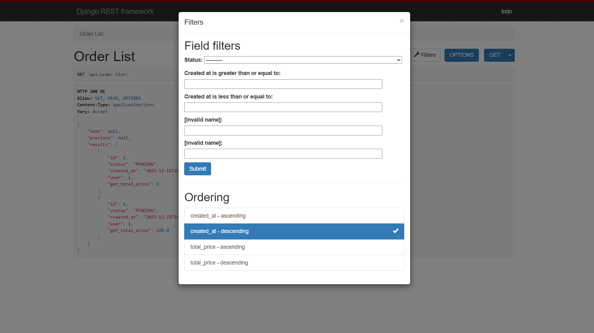
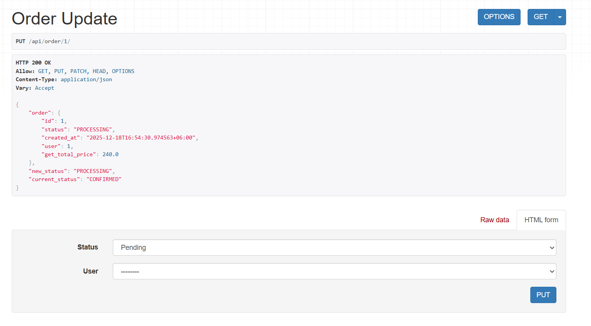
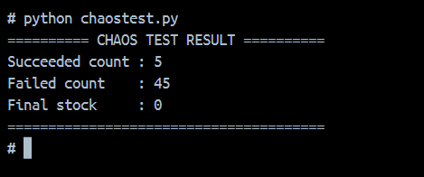
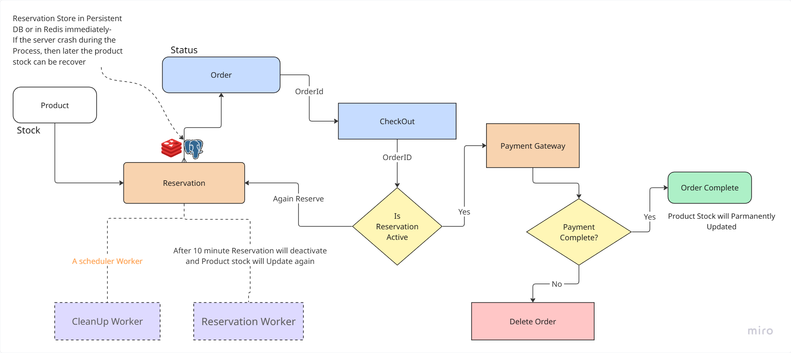

how to run the project?
clone the repository
run 
```bash
docker compose build
```
```bash
docker compose up
```

then open http://127.0.0.1:8000 in your browser

Guidline
1. http://127.0.0.1:8000/api/create-products/
    - you can create products - List of products

2. http://127.0.0.1:8000/api/reservation/
    - POST /api/reservations/ creates reservation for 10 minute
        - reserved_stock using `Transaction`
        - used celery `background` task to update reservation after 10 minute - it will update status as `expired` and restore the product stock
    - implemented `celery-beat` for reservation cleanup - preodic

3. http://127.0.0.1:8000/api/create-order/
    - POST /api/orders/ creates order
    - you can also create Order Item
        -  crate orderItem (here orderitem price and quantity just for the demo for Sorting and filtering Purposes)

4. http://127.0.0.1:8000/api/order-list/
    - GET /api/orders/ must support:
        - filter: date range, status, min/max total
        - sort: newest, highest value
        - cursor pagination
    
    

5. http://127.0.0.1:8000/api/order/1/
    - GET /api/orders/1/ updates order
    - you can update order status but only if the current status is allowed to transition to the new status

    

6. execute the `chaostest.py` file to test the concurrency
    - You will see the result in the terminal
    


## Task 1
- Created Product model
- Created Reservation model
- POST /api/reservations/ creates reservation for 10 minute
    - reserved_stock using `Transaction`
    - used celery `background` task to update reservation after 10 minute
- implemented `celery-beat` for reservation cleanup 


## Task 2:
- set up some rules for order status transition
- then only used on if condition to check that the current status is allowed to transition to the new status, if YES then update the status

## Task 3
- for the concurrency i used `Celery` with Redis as Broker not the Thread
        it will take 50 parallel Purchases attempts at a time and execute them parallelly
    
  for the chaos test i used the chaostest.py file
    ```bash
    job = group(attempt_purchase_task.s(product.id) for _ in range(50))
    result = job.apply_async()
    outputs = result.get()
    ```
  to send the requests parallelly i used the group function and got the result at once
    
    
    

## Task 4
GET /api/orders/ must support:
    - filter: date range, status, min/max total
    - sort: newest, highest value
    - cursor pagination
    
for the filter i used django-filter and created a Custom Class
- then used the class in the OrderListView
- and for the pagination i used cursor pagination

and for the databse indexing i indexed user, created_at, status
- user will be the frequently searched field, 
- created_at will be the frequently sorted field,
- and status will be the frequently filtered field
thats why i indexed them, indexing will use B-Tree search, it will be fast but use more space, thats why i  indexed only the frequently used fields

- for the cursor pagination rest_framework pagination is used
- and use select related becasue i have a foreign key relationship with user model. and it will reduce the number of queries if i had more than one foreign key relationship, but in this case i only have one        foreign key relationship. So it will only fetch the user data in the same query


Task 5:
    - for the audit log i used signals and manually created the audit log


## Diagram
enhance system diagram


Task 6:
  1. Stock reservation is handled inside an atomic database transaction to ensure all-or-nothing behavior and avoid partial updates. Once a reservation is created, it is stored in a persistent database with an expiration time. If the server crashes after reservation but before order confirmation, the reservation remains safe in the database. A background cleanup process releases expired reservations, restoring stock automatically without manual intervention.

    Trade-offs:
    - Reservations may temporarily reduce available stock until expiration.
    - Recovery is time-based, so stock is not immediately released after a crash.
    - Requires a reliable background worker to run cleanup tasks.

  2. cleanup strategy + frequency
    Expired reservations are cleaned up using Celery Beat, which periodically scans for reservations older than 10 minutes and releases the reserved stock back to available stock. This approach ensures recovery even if the request flow is interrupted or the web server crashes.

    Trade-offs:
    - Cleanup is eventually consistent, not real-time.
    - Short expiration improves availability but risks premature release; longer expiration reduces stock availability.

  3. multi-warehouse design choices
    To support multiple warehouses, stock would be tracked per warehouse instead of globally. Each product would have warehouse-specific stock records, and reservations would lock stock at the warehouse level. This allows localized inventory control and prevents contention across warehouses.

    Trade-offs:
    - Increased schema complexity.
    - More complex reservation logic.
    - Better scalability and isolation for large systems.

  4. what, where, invalidation
    Frequently accessed read-heavy data such as product availability can be cached in Redis to reduce database load. Cache entries are updated or invalidated whenever stock changes due to reservation creation, expiration, or order confirmation.

    Trade-offs:
    - Cache invalidation increases complexity.
    - Risk of stale data if invalidation fails.

    